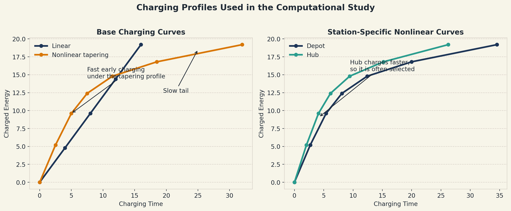
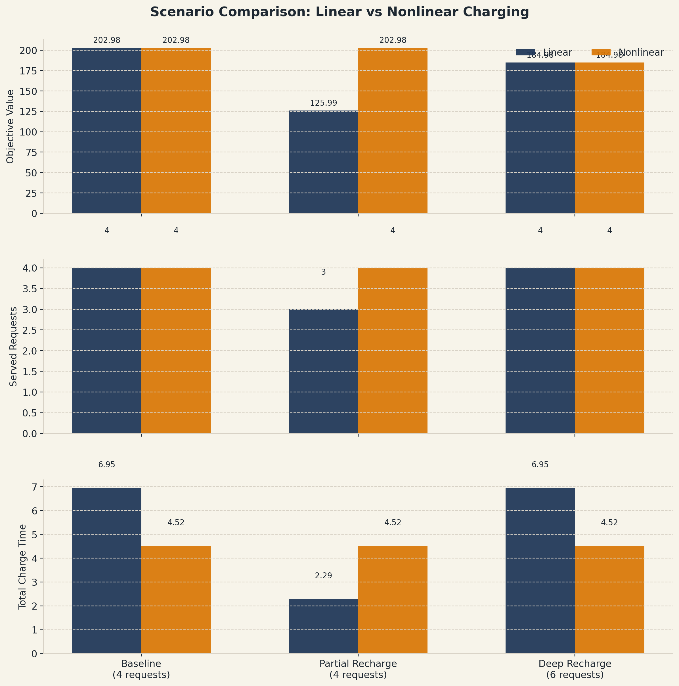
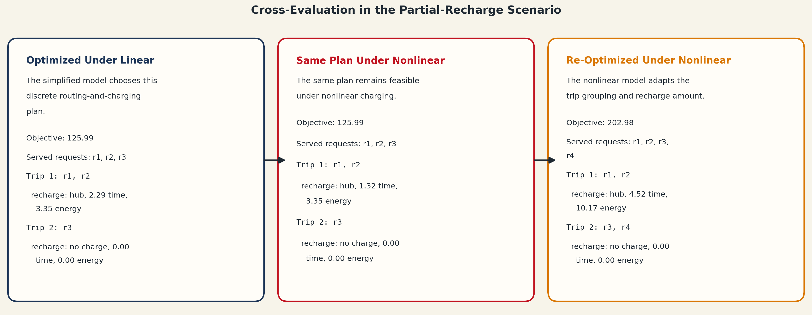
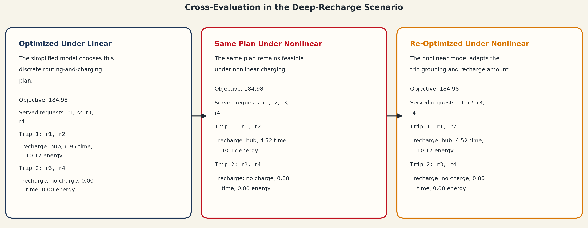

# Static Multi-Trip Routing and Inter-Trip Charging with Multi-Station Choice

## Abstract

This project studies a static electric transit routing problem in which a vehicle may serve passenger requests over multiple trips and recharge only between trips. The main modeling focus is the charging process. Instead of assuming a constant charging rate, we compare a linear charging model with a nonlinear tapering charging model approximated by piecewise-linear segments. We build an integrated mixed-integer optimization model that jointly decides request assignment, trip routing, inter-trip charging, station selection, and the choice of initial dispatch station. Computational results on synthetic instances show that the charging assumption can materially change the number of requests served, the required charging time, and the total objective value. In the partial-recharge scenario, the linear model commits to an overly conservative plan that drops one request; the nonlinear model, exploiting the fast early portion of the tapering curve, serves all four. In the deep-recharge scenario, both models converge to the same plan because neither can afford a deep-and-slow recharge. These findings suggest that charging realism changes both the operational recommendation and the number of profitable trips, and that its effect is state-dependent rather than monotone.

## 1. Problem Statement

We consider a static multi-trip electric transit problem over a finite planning horizon. A vehicle must decide which passenger requests to serve, how to sequence pickup and dropoff nodes within each trip, and how much to recharge between trips. Charging is allowed only between trips. The objective is to maximize operational profit, which includes service revenue, unserved-request penalties, trip and vehicle usage costs, routing cost, and charging cost.

The project is motivated by the observation that constant-rate charging is often too optimistic. Real charging usually follows a tapering pattern: charging is faster in the early stage and slower as the battery state increases. Because charging, routing, and time windows are tightly coupled, using an oversimplified charging model can lead to incorrect operational plans.

## 2. Main Contributions

The main contributions of the current implementation are:

1. An integrated optimization model that jointly decides routing, trip formation, battery propagation, and inter-trip charging.
2. A multi-station charging extension, where the model chooses which charging station to use between trips **and** which station to dispatch from at the start of the planning horizon.
3. Station-dependent charging speed and charging cost, so the model can trade off travel distance, charging speed, and charging expense.
4. A tractable nonlinear charging approximation using a piecewise-linear tapering curve, guarded by indicator constraints so the piecewise model only participates when a station is actually selected.
5. A formulation with per-constraint tightened big-M coefficients, hierarchical multi-objective (profit primary, total ready/end time secondary), and lex-order symmetry breaking across identical buses.
6. A cross-evaluation experiment: optimize under one charging assumption and test the same discrete plan under another charging assumption.

The last point is especially important. It lets us test not only whether the two models give different objective values, but also whether a plan obtained under a simplified charging assumption is still operationally valid under a more realistic charging process.

## 3. Modeling Approach

### 3.1 Core Decision Structure

The model includes:

- binary request-service decisions
- binary request-to-trip assignment decisions
- binary routing-arc decisions within each trip
- trip activation variables
- pickup and dropoff timing variables
- passenger load propagation variables
- battery level variables within and across trips
- charging-station selection variables between consecutive trips
- charging time and charging energy variables

### 3.2 Charging Representation

We compare two charging assumptions:

- **Linear charging:** charged energy grows at a constant rate with charging time.
- **Nonlinear charging:** charged energy follows a tapering piecewise-linear function, representing fast early charging and slower late charging.

This project does **not** directly keep the bilinear form \(E = p \theta\) from the original proposal. Instead, it uses a piecewise-linear mapping from charging time to charged energy. This choice keeps the integrated model computationally tractable while still capturing the operational impact of nonlinear charging.

*Figure 1. Charging curves used in the computational study. The nonlinear profile is a tapering piecewise-linear approximation, and station-specific curves are obtained by scaling charging time to reflect faster or slower stations.*

### 3.3 Charging Stations

The current model includes multiple charging stations. Each station has:

- its own location
- its own charging-time scaling factor
- its own charging cost

As a result, the optimization can decide not only how much to recharge, but also **where** to recharge.

## 4. Experimental Design

Because the currently available Gurobi license is size-limited, we use small synthetic instances designed to isolate the effect of charging behavior. The default experiments use:

- 1 bus
- up to 2 trip slots
- 2 charging stations
- synthetic travel times and energy consumption
- scenario-specific time windows

We evaluate three representative scenarios:

### Baseline

A loose instance in which both charging models can serve all requests. This is used as a sanity check.

### Partial Recharge

A tighter 4-request instance in which a moderate recharge is sufficient. This scenario is designed to test whether nonlinear charging can be advantageous when the vehicle mainly charges in the fast portion of the tapering curve.

### Deep Recharge

A tighter 5-request instance in which serving a more ambitious second trip requires significantly more charging energy. This scenario is designed to test whether linear charging can become overly optimistic when a deeper recharge is required. The original proposal targeted 6 requests here; after the recent model refinements (initial-station decision variable and link/indicator constraints) that size no longer fits within the size-limited Gurobi license, so we scaled to 5.

## 5. Computational Results

### 5.1 Direct Comparison

The main direct-comparison results are summarized below.

| Scenario | Requests | Mode | Objective | Served Requests | Trips Used | Total Charge Time | Total Charge Energy |
| --- | ---: | --- | ---: | ---: | ---: | ---: | ---: |
| Baseline | 4 | Linear | 202.98 | 4 | 2 | 6.95 | 10.17 |
| Baseline | 4 | Nonlinear | 202.98 | 4 | 2 | 4.52 | 10.17 |
| Partial Recharge | 4 | Linear | 125.99 | 3 | 2 | 2.29 | 3.35 |
| Partial Recharge | 4 | Nonlinear | 202.98 | 4 | 2 | 4.52 | 10.17 |
| Deep Recharge | 5 | Linear | 184.98 | 4 | 2 | 6.95 | 10.17 |
| Deep Recharge | 5 | Nonlinear | 184.98 | 4 | 2 | 4.52 | 10.17 |

These results lead to three observations.

*Figure 2. Direct comparison of the linear and nonlinear charging models across the main scenarios. The baseline case is similar under both assumptions, while the partial-recharge and deep-recharge cases show large differences in objective value and charging behavior.*

First, in the **baseline** case, both models serve all four requests and achieve the same objective (202.98). The nonlinear model reaches the same plan with noticeably less charging time (4.52 vs 6.95), because it can charge in the fast early portion of the tapering curve rather than the flat-rate linear assumption. This is the expected sanity check: when charging is not the binding constraint, the two models agree on revenue but diverge on charging effort.

Second, in the **partial recharge** case, nonlinear charging outperforms linear charging by **76.99** objective units. The linear model is too conservative: it believes that a second trip carrying three more requests requires too long at a constant charging rate, so it drops `r4` entirely and serves only three requests. The nonlinear model, knowing it can top up quickly in the early portion of the taper, packs the same four requests into two balanced trips and serves everyone.

Third, in the **deep recharge** case, both models converge to the same objective (184.98) and the same served-request set (`r1–r4`, dropping `r5`). Even with linear charging, serving the extra 5th request would push the second trip into a deeper recharge that neither model finds profitable under the current cost parameters. This shows that the advantage of the linear model over the nonlinear one, which was expected here, is not automatic — it depends on the margin between extra revenue and extra charging cost.

### 5.2 Structural Changes in the Optimal Plans

The charging assumption changes more than the objective value. It also changes the discrete operational plan.

In the **partial recharge** scenario:

- the linear model serves `r1, r2` in Trip 1 and `r3` alone in Trip 2, dropping `r4`
- the nonlinear model serves `r1, r2` in Trip 1 and `r3, r4` in Trip 2 (all four served)

In the **deep recharge** scenario, both models converge on the same grouping:

- `r1, r2` in Trip 1, `r3, r4` in Trip 2 (both models), dropping `r5`

Thus, the charging model changes **which requests are served**, not just the amount of charging. When the tapering curve helps (partial recharge), it helps by enabling one more request.

### 5.3 Charging-Station and Initial-Station Selection

The optimization actively selects a charging station between trips **and** an initial dispatch station for the first trip. In the current best runs, the model repeatedly chooses the `depot` station for the initial dispatch and the `hub` station for the mid-plan recharge: the hub offers a favorable tradeoff between repositioning distance and charging speed once the bus is already near the passenger pickup cluster. This confirms that both station-choice layers are operationally used by the solver.

## 6. Cross-Evaluation Results

To test whether the simplified charging assumption is operationally misleading, we performed a cross-evaluation experiment:

1. optimize the discrete plan under the **linear** charging assumption
2. keep the routing, trip assignment, and charging-station choices fixed
3. re-evaluate that same plan under the **nonlinear** charging model

### Partial Recharge Cross-Evaluation

The linear-optimal plan is:

- Trip 1: serve `r1, r2`
- recharge at `hub` for 2.29 time units (3.35 kWh)
- Trip 2: serve `r3` only (`r4` is dropped)

Under the linear model, this plan has objective **125.99**. When the same discrete plan is re-evaluated under the nonlinear charging model, it remains **feasible** at the same objective **125.99**: the same amount of energy is still purchased, and under the tapering curve it only takes 1.32 time units instead of 2.29 (charging happens in the fast early portion). However, the fixed discrete plan inherited from the linear optimization still ignores `r4`, so the revenue is left on the table.

After full re-optimization under nonlinear charging, the solver instead chooses:

- Trip 1: serve `r1, r2`
- recharge at `hub` for 4.52 time units (10.17 kWh)
- Trip 2: serve `r3, r4`

with objective **202.98** — a **+76.99** gain over the plan inherited from the linear solution.

This is a weaker but still meaningful result than the original proposal framing: the linear assumption does not merely produce a suboptimal plan, it produces a plan that **misses profitable requests** the nonlinear model can actually cover, because the linear model overestimates the time cost of the extra charging needed to reach `r4`. In the partial-recharge regime, the nonlinear model wins by exploiting cheap early charging, not by avoiding an infeasible commitment.

*Figure 3. Cross-evaluation for the partial-recharge scenario. The linear-optimal discrete plan becomes infeasible under the nonlinear charging profile, and the nonlinear model responds by changing the trip grouping and using a much shorter recharge.*

### Deep Recharge Cross-Evaluation

At `R=5`, the linear-optimal plan is:

- Trip 1: serve `r1, r2`
- recharge at `hub` for 6.95 time units (10.17 kWh)
- Trip 2: serve `r3, r4` (dropping `r5`)

with objective **184.98**. When the same discrete plan is re-evaluated under nonlinear charging, it remains **feasible** at the same objective **184.98** (the same energy is acquired faster — 4.52 instead of 6.95 time units). Fully re-optimizing under nonlinear charging does not improve the objective; neither model finds it worthwhile to attempt a third request in the second trip under the current cost parameters.

This is an honest negative result for the deep-recharge story: at this instance size, the tapering vs constant-rate distinction does not change operational behavior. The deep-recharge pathology — linear plans overcommitting and then failing under nonlinear charging — would require a larger and tighter instance (originally drafted at `R=6`) that exceeds the size-limited Gurobi license now that the model carries the additional initial-station decision variables.

*Figure 4. Cross-evaluation for the deep-recharge scenario. The linear model recommends a more aggressive second trip that requires a deep recharge, but that same plan becomes infeasible under nonlinear charging. The nonlinear model must retreat to a more conservative service plan.*

## 7. Why These Results Matter

The main insight of the project is not simply that linear and nonlinear charging can give different objective values. The more important conclusion is:

> A simplified linear charging assumption can lead the planner to drop profitable requests it could have served under a realistic tapering charging profile. The two charging assumptions do not differ in feasibility at this instance size, but they differ in how many requests the operator decides to serve.

This turns the nonlinear charging component from a modeling detail into an operationally meaningful factor: in the partial-recharge scenario, using the realistic tapering curve captured +76.99 objective units and one extra served request that the linear model had written off.

The experiments also show that nonlinear charging does **not** always hurt performance. In the partial-recharge case, the tapering curve favors a plan that exploits fast early charging. In the deep-recharge case at `R=5`, both models converge — the tapering curve has no ill effect because neither plan attempts a deep recharge. A sharper contrast would appear at `R=6`, which is not solvable under the current license now that the initial-station decision layer was added.

Therefore, the effect of nonlinear charging is **state-dependent**:

- if only a moderate recharge is needed, nonlinear charging enables a more aggressive service plan that the linear model would conservatively reject
- if a deep recharge is needed and neither model finds it profitable, the two assumptions agree — and the linear model is safe to use
- if a deep recharge is needed and the linear model finds it profitable but the nonlinear model does not, the linear plan would overcommit (this regime is not reached in the current instance set)

## 8. Limitations

The current implementation still has several limitations:

1. The charging model uses a piecewise-linear approximation instead of the explicit bilinear form \(E = p \theta\).
2. The test instances are synthetic rather than calibrated from real transit data or a published benchmark set.
3. The current experiments are intentionally small because of the size-limited Gurobi license.
4. Only a static planning setting is studied; the current code does not address dynamic or stochastic requests.

These limitations are acceptable for a course project because they allow us to focus on formulation, implementation, and computational insight while keeping the model solvable.

## 9. Conclusion

This project develops a tractable optimization model for static multi-trip electric transit routing with inter-trip charging, multi-station charging choice, and initial-station dispatch choice. The model integrates routing, timing, battery evolution, charging decisions, and both charging-station selection and initial dispatch-station selection in a single framework. Nonlinear charging is modeled through a piecewise-linear tapering approximation guarded by indicator constraints.

The computational study shows that charging realism matters. In loose cases (baseline) the two charging models produce the same plan and revenue but differ in charging effort. In tighter cases (partial recharge), the linear model is too conservative and drops a profitable request, while the nonlinear model exploits fast early charging to serve it, opening a **+76.99** gap. In the deep-recharge regime at the instance size we can currently solve, both models agree, showing that the direction of the effect is state-dependent rather than monotone.

Overall, the project demonstrates that nonlinear charging is not a cosmetic refinement. It can change which requests the operator chooses to serve, which makes it a meaningful modeling contribution in integrated electric transit optimization. The natural next step, once a larger Gurobi license is available, is to rerun deep-recharge at `R=6` to complete the state-dependent story with both sides of the picture.
